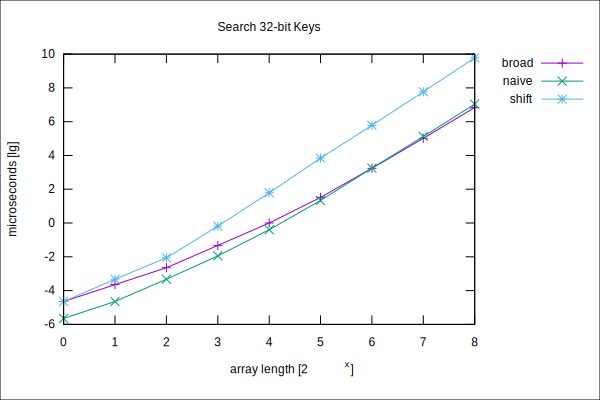

Broadword-Search
================

When storing integers of fixed but arbitrary bit width `b` in an array `A` storing these integers bit-compact, 
searching for an integer in this array is tedious.
Here, we provide a broadword search approach.

The experiments show that for large enough arrays, the broadword search pays off.
The experiments are conducted as follows:
First, we fix the bit width `b`. 
Then we fill an array `A` with random but pairwise different integers up to a certain length (since all integers are different, `A`'s length cannot exceed `2^b`).
Next, we iterate over all elements of `A` and query for this element in `A`.
For the query, we provide three approaches, terminating whenever they find the query element (or when they reach the end of `A`).

- The first is `naive` that scans `A` using bit operations to extract the next chunk of bit size `b` from `A`
- The second, `broad`, generates a broadword pattern from the query element, and then scans `A` in chunks of bit size `ceil(64/b)*b` while matching this chunk with the broadword pattern
- The third, `shift`, scans `A` in 64-bit chunks, creating a broadword pattern on the fly that matches the `b` bit boundaries of the chunk. Here, we neglect the bits on the border to the next or previous chunk (these bits exist only when `b` does not divide 64), which we subsequently have to scan if we fail to find the element.

Although `shift` is slower than `broad` in the experiments, it has the potential to be rewritten for SIMD instructions.

The `x` axis denotes the length of `A` as a power of two. 
The `y` axis are microseconds in logscale. This is the time needed to find all elements of `A` in `A`.
